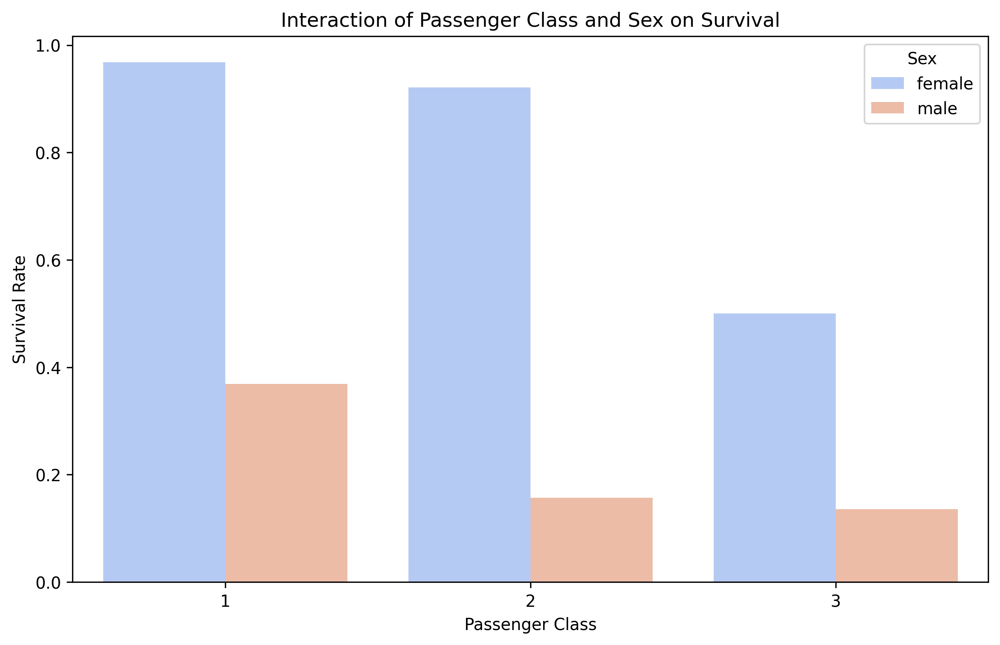
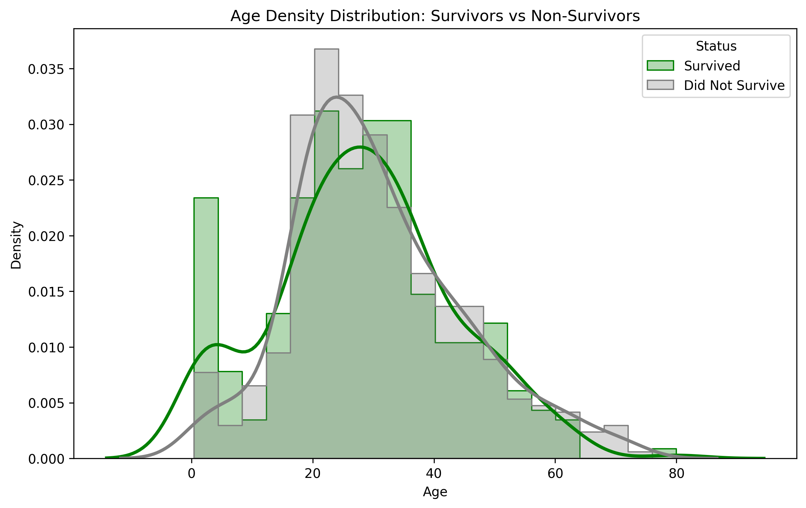

# AutoScholar-MVP

**Autonomous Research Agent** - Generate publication-quality scientific papers using Gemini AI.

## Features

- 🔬 **Dual-Path Ingestion**: PDF vision (no OCR errors) + text file processing
- 📊 **Smart Analyst**: Auto-generates charts from data with self-correction
- ✍️ **Dual Persona Writer**: Author mode for creation, Editor mode for refinement
- 🎯 **Quality Loop**: Iterative improvement until score ≥ 9.5/10
- 📈 **Real-Time Progress**: Live CLI visualization of pipeline stages

## Quick Start

### 1. Install Dependencies

```bash
pip install -r requirements.txt
```

### 2. Set Up API Key

```bash
# Copy the example env file
cp .env.example .env

# Edit .env and add your Gemini API key
# GEMINI_API_KEY=your_key_here
```

### 3. Add Your Data

```
inputs/
├── references/     # Drop PDF papers and .txt/.md notes here
├── raw_data/       # Drop CSV data files here
└── user_draft/     # (Optional) Put draft.md here for refinement
```

### 4. Run

```bash
# Create mode - generate new paper
python main.py --topic "Impact of AI on Healthcare"

# Refine mode - improve existing draft
python main.py --mode refine

# Dry run - validate setup
python main.py --dry-run
```

## Project Structure

```
AutoScholar-MVP/
├── main.py                 # CLI entry point
├── config.yaml             # Model & iteration settings
├── requirements.txt        # Dependencies
├── inputs/                 # Your input data
├── src/
│   ├── client.py          # Gemini API wrapper
│   ├── state.py           # Data schemas & state
│   ├── ingestion.py       # Reference & data loading
│   ├── tools.py           # Python sandbox for charts
│   ├── progress.py        # CLI progress display
│   ├── graph.py           # LangGraph orchestration
│   └── agents/
│       ├── analyst.py     # Data → Charts → Insights
│       ├── writer.py      # Author/Editor personas
│       └── reviewer.py    # Scoring & feedback
└── runs/                   # Output (auto-created)
    └── Job_YYYYMMDD_HHMMSS/
        ├── FINAL_PAPER.md
        ├── run.log
        ├── figures/
        └── ...
```

## Configuration

Edit `config.yaml` to customize:

```yaml
models:
  text: "gemini-2.5-pro-preview-06-05"
  vision: "gemini-2.5-pro-preview-06-05"

iteration_limits:
  min: 2           # Minimum iterations per section
  max: 6           # Maximum iterations
  score_threshold: 9.5  # Quality threshold
```

## Modes

### Create Mode (Default)
Generate a paper from scratch using:
- PDF references for citations
- CSV data for analysis and charts
- AI-driven writing with iterative improvement

### Refine Mode
Improve your existing paper:
1. Place your draft in `inputs/user_draft/draft.md`
2. Run `python main.py --mode refine`
3. The Editor persona preserves your voice while fixing issues

## License

MIT

## Proof of Concept: Titanic Survival Analysis

To demonstrate AutoScholar's capabilities, we ran it on the classic **Titanic dataset** from Kaggle (`Titanic-Dataset.csv`). The goal was to identify the primary factors traversing survival probability.

**AutoScholar automatically:**
1.  Ingested the raw CSV data.
2.  Formulated hypotheses about gender, class, and age.
3.  Wrote Python code to generate visualizations and statistical tests.
4.  Drafted a full research paper interpreting the results.

### Key Findings
*   **"Women and Children First"**: Gender was the strongest predictor ($p < 0.001$), with female survival at **74.2%** vs. male survival at **18.9%**.
*   **Class Divides**: 1st Class passengers had a **63%** survival rate, compared to just **24.2%** for 3rd Class.
*   **Complex Interactions**: The "women first" rule was heavily stratified by class. 3rd class men had the lowest survival chance (<20%).

### Generated Visualizations

**Survival by Class and Gender**
*Shows that while women had an advantage, class acted as a powerful multiplier.*


**Age Distribution**
*Shows a clear priority for saving infants and toddlers (spike in survival density on the left).*


[📄 **Read the Full Generated Paper**](examples/titanic_analysis/Titanic_Paper.md) | [📂 **View All Figures**](examples/titanic_analysis/)

