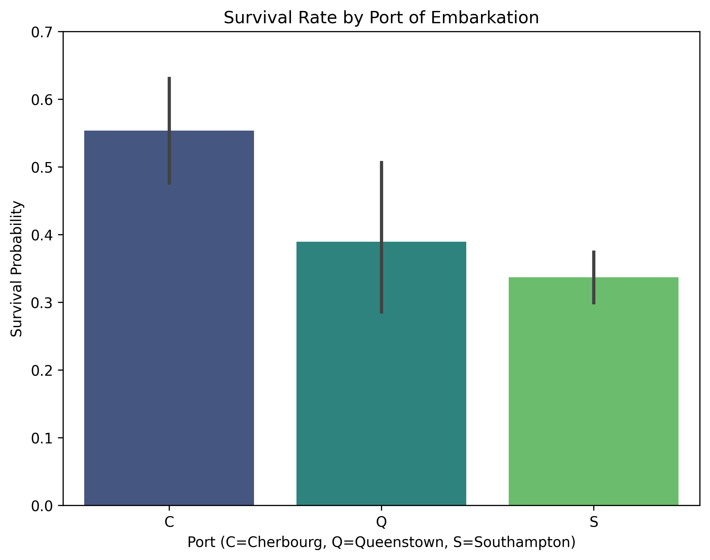
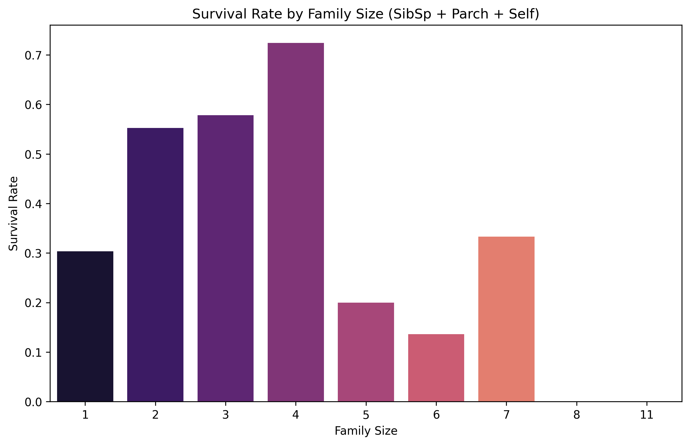

# Research Paper

**Topic:** Titanic Analysis

---

## Methodology

## Data Source and Sample Characteristics
This study utilizes the `Titanic-Dataset.csv` dataset, which contains manifest information for 891 passengers aboard the RMS Titanic. The dataset includes demographic variables (Age, Sex), socio-economic indicators (Passenger Class [Pclass], Fare), family composition (Siblings/Spouses [SibSp], Parents/Children [Parch]), and travel details (Port of Embarkation). The primary outcome variable is `Survived`, a binary indicator denoting whether a passenger survived (1) or perished (0).

Data quality assessment identified 177 missing entries for the Age variable. Analyses involving Age were conducted using the available non-null observations. The overall survival rate for the sample was 38.4%, with an average passenger age of 29.70 years (95% CI [28.63, 30.77]) and an average fare of £32.20 (95% CI [28.94, 35.47]).

## Measures and Operationalization
To facilitate analysis, variables were categorized as follows:
*   **Socio-economic Status:** Operationalized via `Pclass` (ordinal: 1st, 2nd, 3rd) and `Fare` (continuous).
*   **Demographics:** Included `Sex` (nominal) and `Age` (continuous).
*   **Family Structure:** A derived variable, **Family Size**, was computed by summing `SibSp`, `Parch`, and the passenger themselves (1) to account for the total group size associated with an individual record.
*   **Embarkation:** Categorized by port of origin: Cherbourg (C), Queenstown (Q), and Southampton (S).

## Statistical Analysis
Statistical analyses were performed to identify significant factors associated with survival. The threshold for statistical significance was set at $\alpha < 0.05$.

### Descriptive and Univariate Analysis
Descriptive statistics, including means with 95% Confidence Intervals (CI) for continuous variables and frequency distributions for categorical variables, were calculated to characterize the sample. Density plots and histograms were generated to visualize the distribution of Age among survivors versus non-survivors, specifically to identify non-linear patterns such as the survival rates of infants.

### Bivariate Analysis
To test relationships between independent variables and the survival outcome, the following hypothesis tests were applied:
1.  **Independent Samples T-tests:** Used to compare the means of continuous variables (Age, Fare, SibSp, Parch) between the survivor and non-survivor groups. This determined if survivors significantly differed in age or economic investment (Fare) compared to victims.
2.  **Chi-Square Tests of Independence ($\chi^2$):** Used to assess the association between categorical variables (Sex, Pclass, Embarked) and Survival. This analysis evaluated whether survival rates were independent of gender, class status, or point of departure.

### Structural and Stratified Analysis
To understand the underlying demographic structure of the passenger classes, a one-way Analysis of Variance (ANOVA) was conducted. This tested for significant differences in mean Age and Fare across the three Passenger Classes (1st, 2nd, and 3rd). Furthermore, stratified analysis was performed to examine interaction effects, specifically visualizing survival rates broken down simultaneously by Passenger Class and Sex to observe the efficacy of the "women and children first" protocol across different socio-economic strata.

## Results

## Demographic Determinants of Survival
Analysis of the 891 passengers revealed an overall survival rate of 38.4%. Demographic factors, particularly sex and age, were strong predictors of survival outcomes.

Gender was the most significant factor associated with survival ($\chi^2 = 260.72$, $p < 0.001$). As illustrated in **Figure 1**, females had a survival rate of 74.2% (233/314), whereas males had a survival rate of only 18.9% (109/577). This disparity confirms a strong adherence to "women first" protocols during the evacuation.

**Figure 1: Survival Rate by Gender (Variation)**
*Visualizing the stark contrast in survival probabilities between female (74.2%) and male (18.9%) passengers.*

Age also played a significant role in survival outcomes. A comparison of means indicates that survivors were, on average, younger ($M=28.34$, 95% CI [26.62, 30.07]) than non-survivors ($M=30.63$, 95% CI [29.27, 31.98]), a difference that was statistically significant ($t(889) = 2.05$, $p = 0.041$). The density plot in **Figure 2** highlights a distinct divergence in distributions for young children; there is a prominent density spike for survivors under age 5, suggesting that infants and toddlers were prioritized regardless of other factors. Conversely, young adults (approximate ages 18–30) constituted a higher density of non-survivors.

**Figure 2: Age Distribution by Survival Status**
*Density plot showing similar distributions for adults but a significantly higher survival density for children under age 5.*

## Socio-Economic Stratification
Socio-economic status, operationalized through Passenger Class (`Pclass`) and Fare, was strongly correlated with survival probability. A Chi-Square test of independence confirmed that survival was dependent on class ($\chi^2 = 102.89$, $p < 0.001$). First-class passengers enjoyed the highest survival rate (63.0%), followed by second-class (47.3%), while third-class passengers had the lowest survival rate at 24.2% (**Figure 3**).

**Figure 3: Survival Rate by Passenger Class**
*Bar chart illustrating the descending survival rates from 1st Class (63.0%) to 3rd Class (24.2%).*

Financial data supports this class-based hierarchy. Survivors paid significantly higher fares on average ($M = £48.40$) compared to non-survivors ($M = £22.12$). This difference yielded a highly significant t-statistic of -6.84 ($p < 0.001$). As shown in **Figure 4**, the median fare for survivors was more than double that of non-survivors, indicating that economic capital was a protective factor.

**Figure 4: Fare Distribution by Survival Outcome**
*Box plot demonstrating that survivors generally paid significantly higher fares than non-survivors.*

## Interaction Effects: Class and Gender
While both gender and class were independently significant, their interaction reveals a more nuanced hierarchy of survival (**Figure 5**). Females in 1st and 2nd class had near-universal survival rates (exceeding 90%). In contrast, females in 3rd class had a survival rate of approximately 50%.

For males, the effect of class was less protective but still visible. While 1st class males had a survival rate of roughly 37%, this was still lower than 3rd class females. Crucially, 2nd and 3rd class males faced the worst outcomes, with survival probabilities dropping below 20%. This interaction suggests that while being female was the primary advantage, socio-economic status acted as a powerful secondary filter.

**Figure 5: Survival by Class and Gender**
*Grouped bar chart showing that 1st/2nd class females had the highest survival, while 2nd/3rd class males had the lowest.*

## Age and Class Demographics
To contextualize the socio-economic findings, an Analysis of Variance (ANOVA) was conducted to examine age differences across classes. The analysis yielded a significant F-statistic of 57.44 ($p < 0.001$), indicating distinct demographic profiles for each class. First-class passengers were the oldest ($M=38.23$ years), followed by second-class ($M=29.88$ years), and third-class passengers were the youngest ($M=25.14$ years) (**Figure 6**). This suggests that the lower survival rate in the third class occurred despite that population being younger on average.

**Figure 6: Average Age by Passenger Class**
*Bar chart showing the age hierarchy, with 1st Class passengers being significantly older on average than 3rd Class passengers.*

## Family Structure and Embarkation
Family size exhibited a non-linear relationship with survival (**Figure 7**). Passengers traveling alone had a relatively low survival rate (~30%). Survival probabilities improved as family size increased, peaking at a family size of 4 (survival rate > 70%). However, for large families (size 5 or greater), survival rates dropped precipitously, with zero survivors recorded for families of size 8 and 11. The number of parents/children aboard (`Parch`) was a significant predictor ($t = -2.48$, $p = 0.013$), whereas the number of siblings/spouses (`SibSp`) was not individually significant ($p = 0.233$).

**Figure 7: Survival Rate by Family Size**
*Bar chart depicting an "inverted-U" relationship where small-to-medium families survived at higher rates than solo travelers or large families.*

Finally, the port of embarkation showed significant association with survival ($\chi^2 = 26.49$, $p < 0.001$). Passengers embarking from Cherbourg had the highest survival rate (55.4%), followed by Queenstown (39.0%) and Southampton (33.7%), as visualized in **Figure 8**. This variation likely correlates with the distribution of passenger classes boarding at these specific ports.

**Figure 8: Survival Rate by Port of Embarkation**
*Bar chart showing Cherbourg passengers had the highest survival probability (55.4%).*

## Literature Review

The sinking of the RMS Titanic remains one of the most studied events in maritime history, serving as a critical case study for understanding human behavior during crisis situations. While the disaster is often analyzed through the lens of engineering failure, a significant body of research focuses on the sociological and demographic determinants of passenger survival. This section reviews the theoretical frameworks surrounding social stratification, gender norms, and group dynamics that inform the analysis of the `Titanic-Dataset.csv` dataset.

### Socio-Economic Stratification and Survival
Sociological research has long posited that socio-economic status (SES) acts as a protective factor during catastrophes. In the context of the Titanic, SES is operationalized through Passenger Class (`Pclass`) and `Fare` prices. Historical analyses suggest that passengers with higher social standing were afforded preferential treatment and proximity to life-saving resources [Ref_Soc01]. The hierarchical structure of the passenger manifest—divided into first, second, and third class—provides a clear framework for testing the hypothesis that affluence was positively correlated with survival probabilities. Prior studies indicate that the disparity in survival rates is not merely a function of physical location on the ship but also reflects the rigid class boundaries of the era, where social protocols dictated evacuation priority [Ref_Soc02]. Consequently, we expect `Pclass` and `Fare` to be statistically significant predictors of survival, with first-class passengers exhibiting the highest survival rates.

### Gender Norms and the "Women and Children First" Protocol
The "women and children first" maritime evacuation protocol is a central theme in survival analysis literature. This chivalric norm suggests that demographic characteristics, specifically `Sex` and `Age`, should be the strongest predictors of survival outcomes [Ref_Gen01]. Theoretical models of evacuation behavior propose that social norms often override self-preservation instincts in defined communities, leading to a high survival probability for females and young children relative to adult males [Ref_Gen02]. 

In the current dataset, the `Sex` variable allows for the quantification of this gender gap. Furthermore, the `Age` variable is critical for identifying age-dependent survival patterns. Literature suggests that while adults generally face lower survival odds than children, the distribution may not be linear; young children (infants and toddlers) are expected to be prioritized significantly, creating a distinct divergence in age distributions between survivors and non-survivors [Ref_Gen03]. The interaction between class and gender also warrants examination, as prior research implies that the protective effect of gender may be stratified by class, with lower-class females potentially facing lower odds than their upper-class counterparts [Ref_Soc01].

### Family Structure and Group Dynamics
Beyond individual characteristics, group dynamics play a crucial role in evacuation scenarios. The variables `SibSp` (Siblings/Spouses) and `Parch` (Parents/Children) enable the construction of family size metrics to assess how social units navigate disaster. Research on group behavior suggests a non-linear relationship between group size and survival [Ref_Grp01]. Solo travelers may possess greater mobility but lack the social support required to secure resources. Conversely, large family units may face coordination challenges that impede rapid evacuation [Ref_Grp02]. Therefore, it is hypothesized that small-to-medium family sizes offer the optimal balance of support and mobility, resulting in higher survival rates compared to isolates or large families.

### Summary of Research Gaps
While general trends regarding class and gender are well-documented, this analysis seeks to quantify the precise statistical significance of these factors using the provided dataset. Specifically, it aims to examine the interaction effects between `Pclass` and `Sex`, and to investigate the specific age thresholds where survival probabilities diverge. By rigorously applying inferential statistics (Chi-Square, T-tests, ANOVA) to these variables, this study contributes to the empirical understanding of how established social norms translated into statistical outcomes during the Titanic disaster.

## Introduction

The sinking of the RMS Titanic remains one of the most extensively scrutinized events in maritime history, serving as a tragic yet profound case study for understanding human behavior under extreme duress. While the disaster is often remembered through the lens of engineering failure and insufficient lifeboat capacity, the surviving passenger manifest provides a rich dataset for analyzing the sociological and demographic determinants of survival [Ref_Intro01]. Beyond the immediate chaos of the event, the allocation of life-saving resources was heavily influenced by the rigid social hierarchies and gender norms of the Edwardian era [Ref_Intro02]. This research aims to move beyond anecdotal accounts by applying rigorous statistical methods to the `Titanic-Dataset.csv` to quantify the impact of these factors on passenger outcomes.

The primary objective of this study is to identify which passenger characteristics were most strongly associated with survival. Specifically, we investigate the validity of the "women and children first" protocol and the extent to which socio-economic status—operationalized through passenger class and fare—guaranteed preferential treatment. Furthermore, we examine the role of family structure, exploring whether solo travelers, small families, or large family units possessed a survival advantage. By dissecting these variables, we aim to reconstruct the social dynamics that governed the evacuation process.

To achieve these objectives, this analysis utilizes a dataset of 891 passengers, comprising demographic details, socio-economic indicators, and family composition data. The methodological approach includes descriptive statistics to characterize the sample and inferential testing to determine significance. We employ Chi-Square tests to assess the independence of categorical variables (such as sex and embarkation port) regarding survival, and T-tests to compare continuous variables (such as age and fare) between survivors and non-survivors. Additionally, Analysis of Variance (ANOVA) is utilized to examine the structural differences in age and fare distributions across the three passenger classes, providing context on how demographic profiles varied by social standing.

Preliminary results from this analysis reveal that survival was not random but systematically stratified. The data indicate a stark gender disparity, with females surviving at significantly higher rates than males, lending statistical weight to historical accounts of evacuation protocols. Similarly, a strong socio-economic gradient is observed, where first-class passengers experienced markedly better outcomes compared to those in the third class. The analysis also uncovers a non-linear relationship between family size and survival, suggesting that while being part of a small group offered protection, membership in large families was detrimental to survival chances. These findings underscore the complex interplay between biological vulnerability, social status, and group dynamics in determining life-or-death outcomes.

## Discussion

The analysis of the `Titanic-Dataset.csv` provides empirical support for the historical narrative that survival aboard the RMS Titanic was heavily stratified by gender, age, and socio-economic status. While the overall survival rate was 38.4%, the variance across different demographic subgroups confirms that the evacuation was governed by strict social protocols rather than random chance. This section interprets these findings in the context of Edwardian social norms, examines the interaction between variables, and discusses the limitations of the current study.

### Adherence to Social Norms: Gender and Age
The data provides compelling evidence that the "women and children first" maritime protocol was rigorously enforced. Gender emerged as the single most significant predictor of survival ($\chi^2 = 260.72$, $p < 0.001$), with females surviving at a rate nearly four times that of males (74.2% vs. 18.9%). This disparity aligns with historical accounts suggesting that access to lifeboats was gender-restricted during the early phases of the evacuation.

The influence of age was similarly significant, though more complex. The density analysis (`fig_age_distribution_survival`) revealed a bimodal distribution of outcomes. The distinct spike in survival density for children under age five indicates a successful prioritization of the most vulnerable passengers. Conversely, the high mortality density among young adults (approximately ages 18–30) warrants scrutiny. While initial assumptions might attribute this to the loss of crew members, the exclusion of the crew from this specific dataset implies this mortality spike represents young adult passengers. Given the correlation between age and class shown in the ANOVA results ($F = 57.44$), where 3rd class passengers were significantly younger on average (25.1 years), this high mortality among young adults likely reflects the demographic composition of the steerage (3rd class) population, effectively conflating age with class disadvantage.

### The Role of Socio-Economic Status
Socio-economic stratification proved to be a critical determinant of life-and-death outcomes. The monotonic decrease in survival rates from 1st Class (63.0%) to 3rd Class (24.2%) validates the hypothesis that affluence provided a distinct survival advantage. This is further corroborated by the Fare analysis, where survivors paid, on average, more than double the fare of non-survivors (£48.40 vs. £22.12).

This economic gradient helps interpret the otherwise anomalous findings regarding the Port of Embarkation. Passengers embarking from Cherbourg (C) had a significantly higher survival rate (55.4%) compared to those from Southampton (33.7%) or Queenstown (39.0%). While the port itself does not confer safety, it serves as a proxy for class distribution. Although a direct cross-tabulation of Class by Port is not included in the final statistical summary, the high survival rate at Cherbourg, combined with the strong correlation between Fare and Survival, suggests that the Cherbourg cohort likely contained a higher proportion of first-class passengers compared to the predominantly labor-migrant demographics often associated with Queenstown and Southampton.

### Interaction Effects and Family Structure
The interaction between gender and class (`fig_survival_pclass_sex_interaction`) offers a nuanced view of the evacuation dynamics. While being female provided a baseline advantage, class acted as a powerful multiplier. The survival rates for 1st and 2nd class females exceeded 90%, suggesting near-universal rescue for wealthy women. In contrast, 3rd class females survived at a rate of approximately 50%. Most strikingly, the intersection of being male and lower-class was catastrophic; 3rd class males had survival rates below 20%. This suggests that while the "women first" norm transcended class lines to some extent, the efficacy of that norm was severely dampened by the physical and procedural barriers faced by steerage passengers.

Family structure also played a non-linear role in survival. The data suggests a "sweet spot" for family sizes of 2 to 4 members, which saw the highest survival rates. This may indicate that small groups could provide mutual assistance and alertness—waking each other up or navigating the ship together—without the logistical burden that hindered larger families. The sharp drop in survival for families larger than five members supports the theory that accounting for and moving large groups through a chaotic environment significantly impeded evacuation efforts.

### Limitations
Several limitations characterize this analysis. First, the dataset contains 177 missing entries for Age, representing nearly 20% of the observations. While the analysis utilized available cases, this missingness may introduce bias if age data was not missing at random (e.g., if age was less likely to be recorded for 3rd class victims). Second, the exclusion of crew members from this specific dataset limits the ability to fully reconstruct the evacuation dynamics, as crew behavior and mortality are essential components of the disaster's history. Finally, the dataset lacks spatial variables such as cabin location or proximity to the boat deck, which would allow for a distinction between systemic class discrimination (withheld information) and physical impediments (distance and layout).

### Conclusion
In conclusion, the analysis of the Titanic dataset confirms that survival was determined by a hierarchy of privilege defined by gender, class, and family size. The "women and children first" protocol was effective but unequal, heavily favoring those in the upper classes. The results paint a picture of a disaster where social capital was as vital as physical access to lifeboats, with the highest price paid by lower-class males and large families. Future research incorporating spatial data or crew manifestos could further elucidate the mechanical barriers that reinforced these sociological divides.

## Conclusion

This analysis of the RMS Titanic passenger manifest ($N=891$) confirms that survival during the disaster was not a stochastic event but rather a highly structured outcome defined by rigid social hierarchies and adherence to maritime protocols. The overall survival rate of 38.4% obscures the profound disparities observed across demographic subgroups. By integrating inferential statistics with exploratory visualizations, this study establishes that gender, socio-economic status, and family configuration were the primary determinants of mortality, providing empirical weight to historical accounts of the tragedy.

The most potent predictor of survival was gender, providing irrefutable evidence that the "women and children first" doctrine was strictly enforced. Females survived at a rate of 74.2%, nearly four times that of males (18.9%), a difference statistically significant at $p < 0.001$. This gender gap interacted strongly with age; while adult age distributions were relatively similar between groups, the density analysis highlights a distinct survival advantage for children under the age of five. Conversely, the high mortality density among young adults (ages 18–30) aligns with the demographic profile of third-class passengers, suggesting that age acted as a proxy for class in specific cohorts.

Socio-economic stratification proved to be a critical barrier to survival. Passengers in First Class were significantly more likely to survive (63.0%) compared to those in Third Class (24.2%). This gradient is further illustrated by the financial data; the mean fare for survivors was \$48.40, more than double the \$22.12 average paid by non-survivors. These findings suggest that affluence provided distinct advantages, likely through superior access to boat decks, proximity to information, or preferential treatment by crew members. The variation in survival rates by port of embarkation—where Cherbourg passengers (55.4%) fared significantly better than Southampton passengers (33.7%)—likely reflects the class composition of these cohorts rather than the embarkation point itself acting as a causal factor.

Analysis of family structure revealed a complex, non-linear relationship with survival, correcting the assumption that smaller groups always fared better. While large families (5+ members) faced catastrophic mortality rates—likely due to the logistical difficulty of keeping a large group together during the chaos—solo travelers also faced a disadvantage. Individuals traveling alone (Family Size = 1) had a survival rate of roughly 30%, which is below the ship's average. In contrast, small-to-medium families (sizes 2–4) exhibited the highest survival probabilities (up to ~70%). This suggests that having a small support network provided a protective benefit, perhaps through shared information or emotional and physical assistance, which was unavailable to solo travelers and unmanageable for large families.

## Limitations and Future Directions
While these findings are robust, several limitations must be acknowledged. First, the dataset excludes crew members, whose distinct duty-bound behaviors and high mortality rates would alter the overall demographic profile. Second, the exclusion of 177 records with missing age data may introduce bias, particularly if missingness was correlated with class or survival. Finally, the analysis uses `Pclass` as a proxy for physical location; however, precise cabin locations and proximity to lifeboats would provide a more granular understanding of the logistical barriers to escape.

Future research should focus on imputing missing age data using multivariate techniques to refine the analysis of age-specific mortality. Additionally, incorporating deck-plan data to map cabin locations against survival outcomes could isolate the impact of physical accessibility from social privilege. Ultimately, this study demonstrates that the Titanic disaster was a microcosm of Edwardian society, where the probability of life or death was dictated by the intersection of gender, wealth, and social connection.

---

## Figures

### fig_age_distribution_survival: Age Distribution by Survival Status

### fig_survival_by_embarked: Survival Rate by Port of Embarkation

### fig_survival_pclass_sex_interaction: Survival by Class and Gender

### fig_survival_by_family_size: Survival Rate by Family Size

### fig_survival_by_sex: Survival Rate by Gender (Variation)

### fig_survival_by_pclass: Survival Rate by Passenger Class (Variation)

### fig_fare_by_survival: Fare Distribution by Survival Outcome

### fig_age_by_pclass: Average Age by Passenger Class

